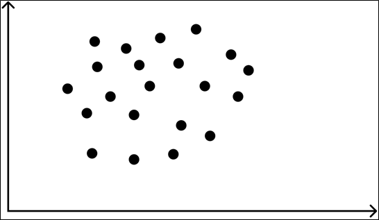
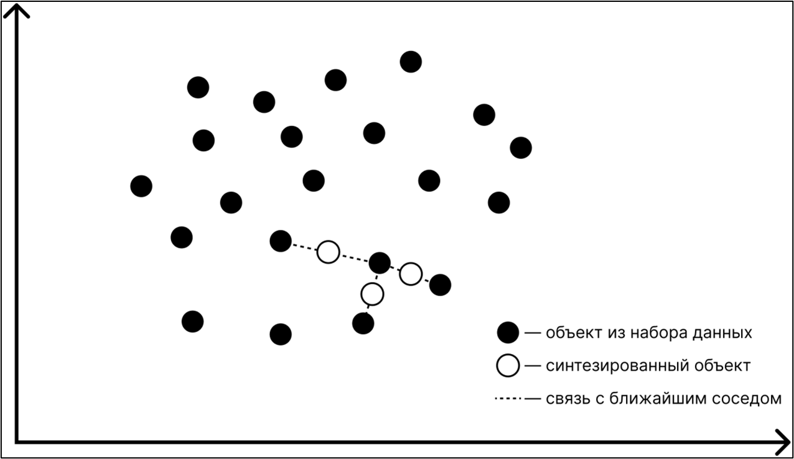
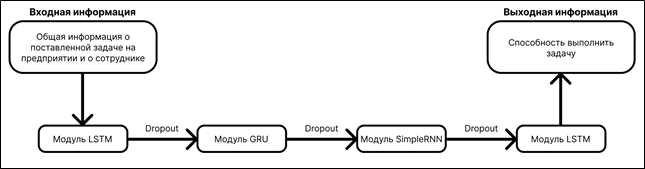
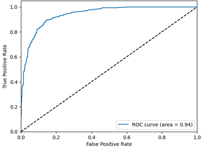

*МИРЭА -- Российский технологический университет, 119454, Россия, г.
Москва, проспект Вернадского, 78, e-mail: dzheykob.obruzin@list.ru*

---------------

**В статье рассматриваются аспекты применения методов искусственного
интеллекта, направленные на автоматизацию выполнения деятельности,
связанной с распределение задач среди сотрудников. Рассматриваются
методы и алгоритмы машинного обучения для построения модуля
искусственного интеллекта, ответственного за принятие решений в
бизнес-процессах, связанных с определением способности выполнения
определенной задачи, посредством прогнозирования.**

---------------

Ключевые слова: модуль информационной системы, распределение задач,
делегирование, искусственный интеллект, машинное обучение, рекуррентные
сети, прогнозирование способности выполнения задач.

# **Введение**

Распределение задач (делегирование) является одним из основных
мероприятий планирования на предприятиях. Главная цель делегирования
заключается в корректном распределении обязанностей среди сотрудников и
достижении установленных результатов с минимизацией возникновения
сопутствующих проблем. Планирование на всех уровнях предприятия играет
важную роль в управленческой деятельности, поскольку, как показывает
многолетний мировой опыт, если, например, у любого экономического
действия отсутствует цель, то, как следствие, отсутствует и смысловая
составляющая. Также на успешное решение поставленных задач большое
влияние оказывают индивидуальные способности сотрудников. Стоит
отметить, что для корректного распределения задач среди сотрудников
важно выделить достаточно большое количество времени, что особенно
характерно для крупных предприятий.

Искусственный интеллект -- это комплекс технологических решений,
позволяющий имитировать когнитивные функции человека и получать
результаты при выполнении практически значимых задач обработки данных,
сопоставимые, как минимум, с результатами интеллектуальной деятельности
человека \[1\].

Область искусственного интеллекта стремительно развивается во всём мире
и предоставляет возможность решать большинство задач с высокой степенью
точности. В рамках предприятия искусственный интеллект позволяет
уменьшить число совершаемых человеком ошибок, поскольку результаты
работы любого интеллектуального алгоритма основываются на существующих
данных, которые появляются в рамках деятельности предприятия за
определённый промежуток времени. Кроме этого, программное обеспечение на
базе искусственного интеллекта способно выполнять работу в беспрерывном
режиме, что является преимуществом перед использованием человеческого
ресурса.

# **Аналитический обзор экспериментального набора данных**

Современные предприятия и организации имеют сложную и динамическую
структуру, в которой сотрудникам постоянно требуется выполнять широкий
спектр задач на высоком уровне. Это условие представляет собой
основополагающий фактор для обеспечения эффективности функционирования
предприятия. По этой причине для более корректного распределения задач
между сотрудниками следует рассматривать такой параметр, как тип задачи.

Также одним из параметров задачи является её сложность. Следовательно, в
интересах предприятия необходимо выбрать высококвалифицированного
сотрудника, чтобы решение трудоёмкого задания было максимально
корректным и точным.

Каждый сотрудник имеет как сильные, так и слабые стороны, которыми он
отличается при выполнении определенных типов задач. В связи с этим важно
вести статистику ключевых показателей эффективности для каждой категории
задач.

Ключевой показатель эффективности (KPI) -- это показатель эффективности,
поддающийся количественному определению и выраженный в терминах целей и
задач предприятия \[2\]. В правильном распределении задач важную роль
играет KPI сотрудника для типа задач, который выбран в качестве первого
параметра.

На любом предприятии время -- ключевой фактор для достижения успеха.
Обычно оно представляется в виде сроков выполнения задачи и достижения
каких-либо поставленных целей. Соблюдение временных рамок позволяет
предприятиям планировать и иметь полное понимание о процессе выполнения
работ, а также обеспечивает предприятию высокий уровень эффективности и
производительности.

Квалификация -- степень профессиональной готовности работников к
выполнению трудовых функций в рамках определенной профессии,
характеризуемая определенными знаниями, навыками и умениями,
приобретенными в процессе специального обучения. При выполнении сложных
задач, требующих специальных знаний и навыков, необходимо пройти процесс
квалификации. Этот процесс может использоваться для проверки и
подтверждения квалификации людей на различных уровнях или для достижения
сторонних целей. Процесс квалификации является важным элементом процесса
обучения и позволяет людям получить необходимый опыт и навыки для
успешной деятельности в определенной области. По этой причине наличие
диплома или сертификата о квалификации немаловажно относится к
распределению задач среди сотрудников.

Уровень образования имеет существенное значение для того, как человек
использует свои знания и умения для получения и осуществления рабочей
деятельности. Высшее образование может включать в себя программы и
курсы, которые предоставляют студентам академические навыки и знания для
последующей карьеры.

Трудовой стаж -- это общее количество лет, проведённых человеком на
рабочем месте. Исследования показывают, что трудовой стаж имеет
положительное влияние на выполнение рабочей деятельности. С длительным
стажем приходит больше знаний и опыта, что улучшает производительность
работы. Таким образом, трудовой стаж также важен в распределении задач.

В результате исследования ключевых факторов, влияющих на эффективность
выполнения тех или иных задач возможно выделить признаки, которые
определяют способность выполнить поставленную задачу сотрудником.

В таблице 1 представлен набор признаков с кратким описанием и типом
значения.

Таблица 1. Описание признаков датафрейма

  --------------------------------------------------------------------------------
  **Признак**       **Тип значения** **Описание**
  ----------------- ---------------- ---------------------------------------------
  task_type         Категориальное   Тип задачи

  deadline          Количественное   Сроки выполнения задачи

  complexity        Количественное   Сложность задачи

  kpi               Количественное   Ключевой показатель эффективности сотрудника

  can_do_task       Количественное   Возможность выполнить определенный тип задач

  qualification     Категориальное   Квалификация в определенном навыке сотрудника

  education_level   Категориальное   Уровень образования (основное общее, среднее
                                     общее, среднее профессиональное, высшее
                                     образование)

  experience        Количественное   Опыт работы в месяцах

  task_status       Категориальное   Способность выполнить задачу
  --------------------------------------------------------------------------------

Table: Таблица 1. Описание признаков датафрейма \label{tab:1}

Каждый признак представляет собой количественное, либо категориальное
значение с общей информацией о сотруднике предприятия или показателе его
эффективности работы.

Количественный признак -- это признак, который возможно измерить в виде
числа или диапазона чисел, используемых для описания атрибутов объектов
или ситуаций.

Качественный признак -- это признак, который может быть описан как
классификация или набор категорий.

В рамках исследования имеется предварительно подготовленный набор
данных, представляющий собой генеральную совокупность из 5213 объектов с
набором признаков, указанных в таблице 1.

# **Синтезирование экспериментального набора данных**

Для того, чтобы провести машинное обучение таким образом, чтобы
спрогнозированный результат был максимально приближен к реальному,
необходимо на основании экспериментального набора данных создать больше
дополнительных объектов, похожих на входные в генеральной совокупности.

Машинное обучение -- это процесс автоматического обучения и
совершенствования поведения системы искусственного интеллекта на основе
обработки массива обучающих данных без явного программирования \[1\].

Синтезирование данных -- это процесс создания новых данных, которые
похожи на реальные данные, но не являются точной копией оригинальных
данных.

В качестве способа синтезирования используется метод увеличения числа
примеров миноритарного класса Synthetic Minority Over-sampling Technique
(далее -- SMOTE).

SMOTE (техника избыточной выборки синтетических меньшинств) -- алгоритм
предварительной обработки данных, используемый для устранения дисбаланса
классов в наборе данных.

На рисунке 1 изображена иллюстрация случайного набора данных.

{width="6.5in"}

В абстрактном виде алгоритм SMOTE описывается следующим образом:

*   находит разность между заданным образцом и его ближайшим соседом;

*   разность умножается на случайное число в интервале от 0 до 1;

*   полученное значение добавляется к заданному образцу для формирования нового синтезированного образца в пространстве признаков;

*   подобные действия продолжаются со следующим ближайшим соседом, до заданного пользователем количества образцов.

На рисунке 2 изображен принцип работы алгоритма SMOTE.

{width="6.5in"}

То есть для получения синтезированного объекта следует:

 

$x_{new} = x_{i} + \lambda*(x_{zi} - x_{i})$

 

где $x_{new}$ -- синтезированный объект;

$x_{i}$ -- рассматриваемый объект;

$\lambda$ -- случайным числом в диапазоне \[0,1\];

$x_{zi}$ -- рассматриваемый объект в качестве ближайшего соседа.

Таким образом, SMOTE позволяет увеличить количество примеров
миноритарных классов, избегая при этом чрезмерного обучения. В--
результате создаются новые синтезированные образцы, близкие к другим
точкам (принадлежащим к миноритарному классу) в пространстве признаков.

**Применение методов искусственного интеллекта для распределения задач
на предприятии**

Для распределения задач на предприятии возможно применить такие методы
искусственного интеллекта, как классификация или регрессия.

Классификация -- задача автоматического определения метки для
неразмеченного образца, где происходит процесс группирования объектов по
категориям на основе предварительно классифицированного тренировочного
набора данных, которое выполняется обучением функции:

 

$Rn\  \rightarrow \left\{ 1,\ \ldots,\ m \right\}$

 

где $Rn\ $-- вектор признаков в один конкретный класс из m различных
классов.

Регрессия -- задача прогнозирования метки с целевым значением для
образца без метки, использующая алгоритм обучения, который принимает на
вход набор размеченных данных и создает модель с неразмеченными данными.

В данном методе алгоритм формирует функцию:

 

$Rn \rightarrow R$

 

где $Rn$ -- определяет непрерывное значение *y* или набор непрерывных
значений, выраженный как вектор *y* \[3\].

Рекуррентные нейронные сети RNN (Recurrent Neural Networks) являются
классом сетей с внутренней памятью, где связи между элементами образуют
направленную последовательность. RNN основываются на концепции
реализации краткосрочной памяти в нейронных сетях, когда на вход нейрона
вместе с информацией о текущем состоянии системы подаётся информация о
предыдущем состоянии этого нейрона \[4\].

В качестве подхода для решения рассматриваемой в рамках данного
исследования задачи, используются рекуррентные нейронные сети, так как
они обладают рядом преимуществ над стандартными алгоритмами машинного
обучения, которые заключаются в способности использовать данные,
полученные в процессе обучения. То есть, рекуррентные нейронные сети
способны обучаться по одному примеру несколько раз, извлекать
закономерности и распознавать паттерны в данных, которые, в свою
очередь, увеличивают точность прогнозирования.

На рисунке 3 изображена структурная схема интеллектуальной системы
автоматического распределения задач на предприятии.

{width="6.5in"}

Традиционная LSTM-сеть с вентилями забывания является нейронной сетью с
тремя входными и выходными каналами \[5\].

GRU -- это модифицированная, упрощенная версия LSTM, в которой
долговременная и кратковременная память объединяется в скрытое состояние
(Hidden State) \[6\].

Заключительный модуль является простой рекуррентной сетью Элмана,
состоящей из трёхслойной нейронной сети с дополнительным набором
специализированных контекстных блоков \[7\]. Скрытый слой соединяется с
контекстными блоками с единичным весом. В соответствии с заданными
правилами обучения на каждом временном шаге на вход сети подаётся
информация, проходящая напрямую к выходному слою, при этом предыдущие
значения скрытого слоя сохраняются в контекстных блоках фиксированными
обратными связями, что позволяет сети сохранять своё текущее состояние.

Определение качества работы нейросетевой модели осуществляется путём
построения ROC-кривой и вычисления площади под кривой AUC-ROC. На
рисунке 4 представлена ROC-кривая для нейросетевой модели на этапе
тестирования.

{width="6.5in"}

# **Заключение**

В ходе экспериментального исследования предметной области результатом
решения проблем эффективности труда и автоматизации бизнес-процессов
предприятия стал модуль искусственного интеллекта для реализации функции
распределения задач среди сотрудников.

Использование модуля искусственного интеллекта с применением подхода на
основе рекуррентных нейронных сетей позволяет более эффективно
распределять задачи, а затем принимать последующие решения.

Также, одним из главных преимуществ модели является её универсальность,
позволяющая легко внедряться в другие предприятия, где присутствует
схожая потребность в автоматизации бизнес-процессов и прогнозировании
способности решения конкретной задачи определенными сотрудниками
предприятия.

# Список литературы

---------------

1. ГОСТ Р 59895-2021 Технологии искусственного интеллекта в образовании.
Общие положения и терминология, 2022.

2. ГОСТ Р ИСО 22400-1-2016 Системы промышленной автоматизации и
интеграция. Ключевые технико-экономические показатели (KPIs) для
управления производственными операциями. Часть 1. Общие положения,
понятия и терминология, 2017.

3. Макеев А.Д., Кузьмин А.Г., Масленников В.В. Информационная система
автоматизации работы отдела по управлению персоналом с модулем
искусственного интеллекта // Электронный научный журнал «ИТ-Стандарт»,
2022, URL: http://itstd-journal.ru.

4. Масленников В.В. Математическая модель интеллектуальной системы
прогнозирования инсульта и её реализация на базе гибридного
нейросетевого алгоритма рекуррентного типа // Научный журнал
«Современная Наука», 2022, URL: http://itstd-journal.ru.

5. Нейросети --- это просто (Часть 4): Рекуррентные сети // MQL5.
\[Электронный ресурс\]: https://www.mql5.com/ru/articles/8385 ([дата
обращения: 17.03.2023]{.underline}).

6\. Управляемый рекуррентный блок (GRU) // URL:
https://www.helenkapatsa.ru/upravliaiemyi-riekurrientnyi-blok/#:\~:text=Управляемый%20рекуррентный%20блок%20(GRU%20--,сети%20(RNN)%2C%20набирающая
%20большую%20популярность ([дата обращения: 17.03.2023]{.underline}).

7. Elshamy, M.M.M. Evaluation of the elastic modulus of pavement layers
using different types of neural networks models / M.M.M. Elshamy,
A.N.Tiraturyan, E.V. Uglova // Advanced Engineering Research.---
2021.--- Vol. 21.--- No 4.--- P. 364--375.--- DOI
10.23947/2687--1653--2021--21--4--364--375.

# References

---------------

1. GOST R 59895-2021 Tekhnologii iskusstvennogo intellekta v
obrazovanii. Obshchie polozheniya i terminologiya, 2022.

2. GOST R ISO 22400-1-2016 Sistemy promyshlennoj avtomatizacii i
integraciya. Klyuchevye tekhniko-ekonomicheskie pokazateli (KPIs) dlya
upravleniya proizvodstvennymi operaciyami. Chast\' 1. Obshchie
polozheniya, ponyatiya i terminologiya, 2017.

3. Makeev A.D., Kuz\'min A.G., Maslennikov V.V. Informacionnaya
sistema avtomatizacii raboty otdela po upravleniyu personalom s
modulem iskusstvennogo intellekta // Elektronnyj nauchnyj zhurnal
«IT-Standart», 2022, URL: http://itstd-journal.ru.

4\. Maslennikov V.V. Matematicheskaya model\' intellektual\'noj
sistemy prognozirovaniya insul\'ta i eyo realizaciya na baze
gibridnogo nejrosetevogo algoritma rekurrentnogo tipa // Nauchnyj
zhurnal «Sovremennaya Nauka», 2022, URL: http://itstd-journal.ru.

5. Nejroseti --- eto prosto (Chast\' 4): Rekurrentnye seti // MQL5.
\[Elektronnyj resurs\]: https://www.mql5.com/ru/articles/8385 ([data
obrashcheniya: 17.03.2023]{.underline}).

6. Upravlyaemyj rekurrentnyj blok (GRU) // URL:
https://www.helenkapatsa.ru/upravliaiemyi-riekurrientnyi-blok/#:\~:text=Управляемый%20рекуррентный%20блок%20(GRU%20--,сети%20(RNN)%2C%20набирающая
%20большую%20популярность ([data obrashcheniya:
17.03.2023]{.underline}).

7. Elshamy, M.M.M. Evaluation of the elastic modulus of pavement
layers using different types of neural networks models / M.M.M.
Elshamy, A.N.Tiraturyan, E.V. Uglova // Advanced Engineering
Research.--- 2021.--- Vol. 21.--- No 4.--- P. 364--375.--- DOI
10.23947/2687--1653--2021--21--4--364--375.
